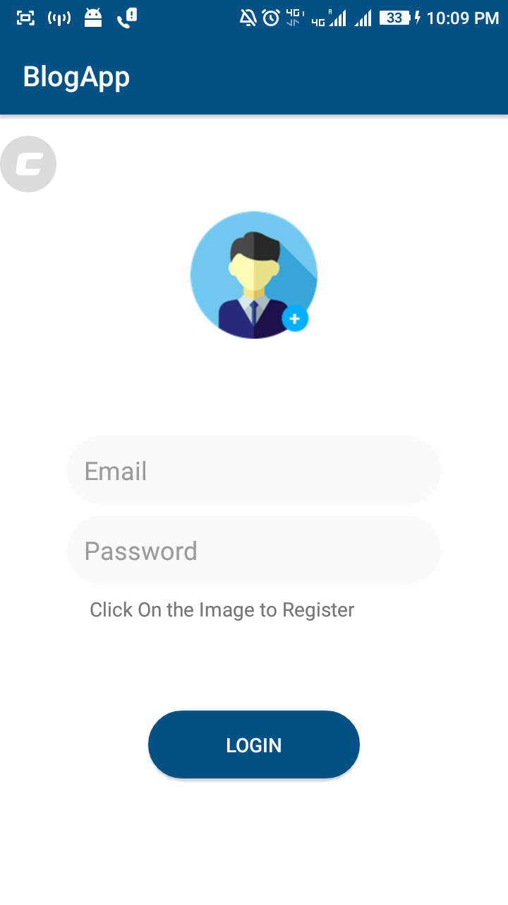
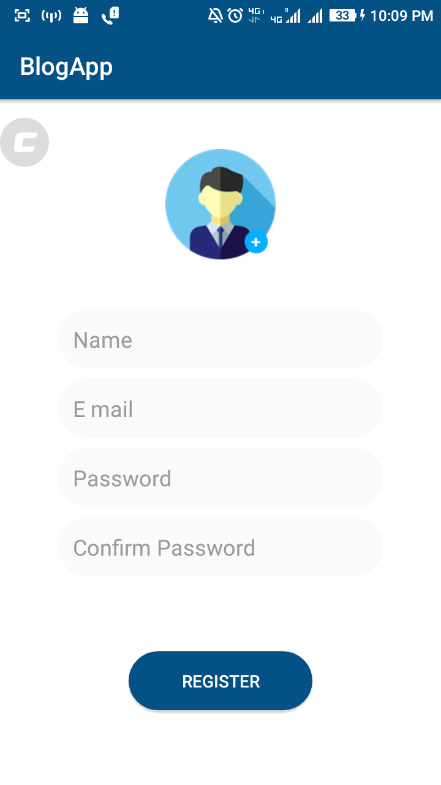
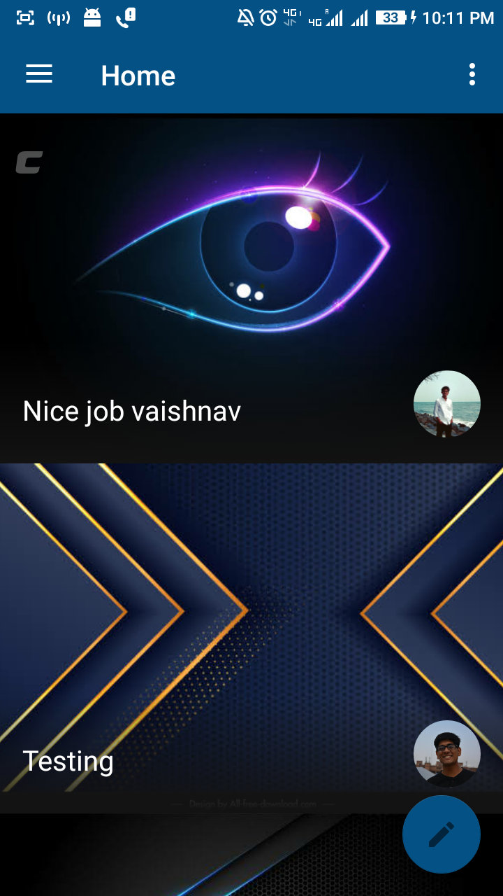
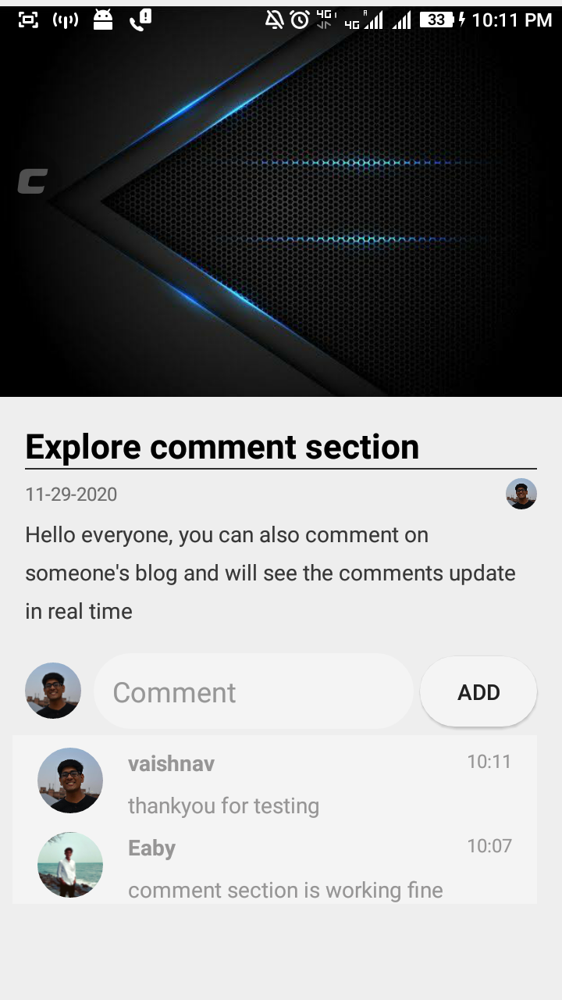
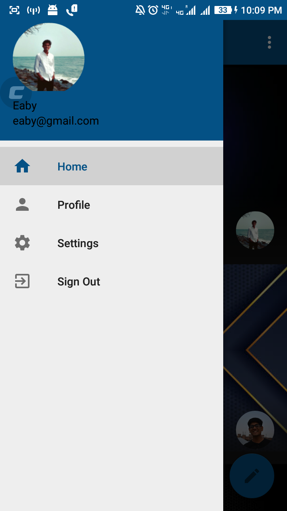

# BlogApp
This is a blog app, you can post blogs and comment on the blog you are interested in.

This project is made purely in kotlin , it uses firebase in its backend to store blog data along with other useful information.
I have also added comment feature which allows you to comment on the posts you like , it updates the comments in realtime.

I have also made a login and register feature , you have to register in order to have a look at posts , once registered you will be directed to the home screen where you can see the posts , 
You can signout anytime using the signout feature in the side navigation drawer , once signed out you can login using your login id and password , note that there is no authentication process , so if you want to just look at the project feel free to use fake data to register.

I hope you enjoy the app , let's meet in the comment section of your blog

            

  
